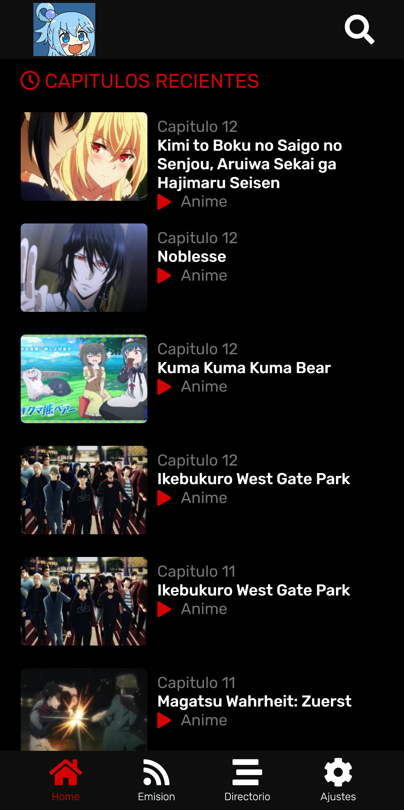
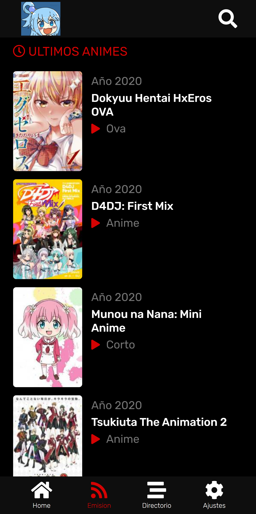
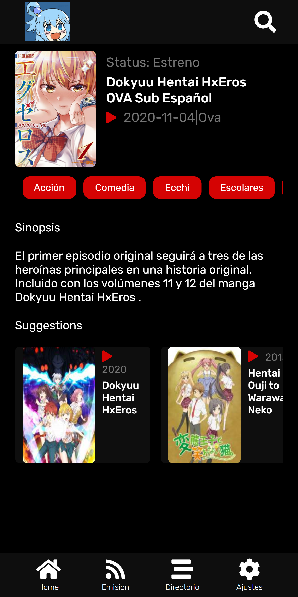
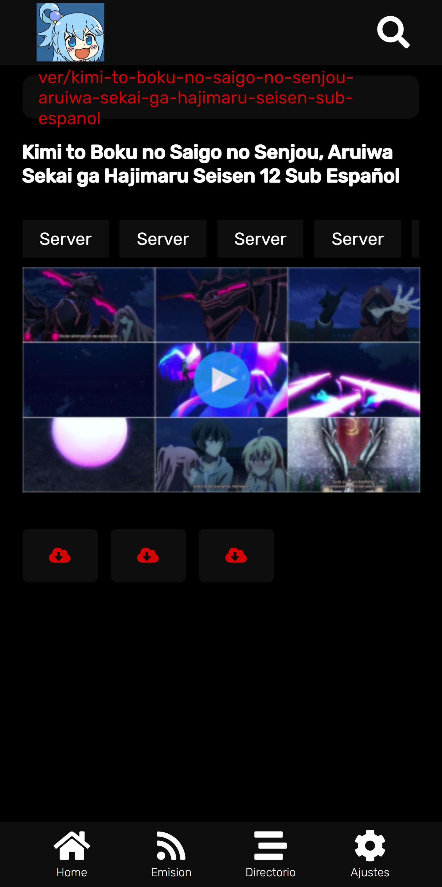
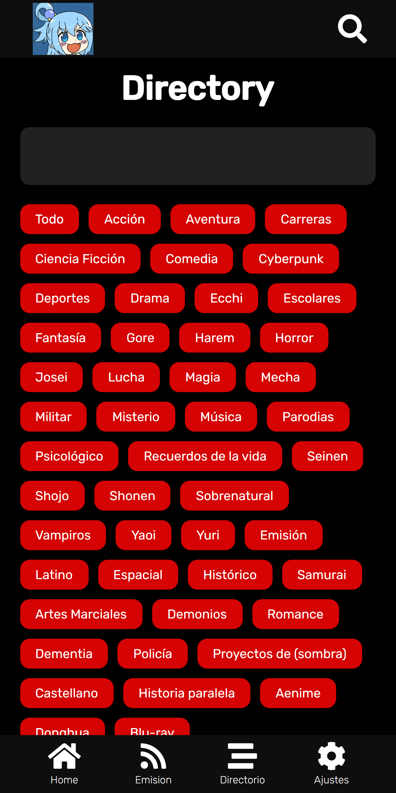

# Anime-Stadia

<div style="display:flex">
    
    
    
    
    
</div>


This project was generated with [Angular CLI](https://github.com/angular/angular-cli) version 11.0.2.

## Development server

```
    npm run dev
```

Navigate to `http://localhost:4200/`. The app will automatically reload if you change any of the source files.

## Code scaffolding

```
    ng generate component component-name
```

You can also use `ng generate directive|pipe|service|class|guard|interface|enum|module`.

## Build

```
    ng build --prod
```

The build artifacts will be stored in the `dist/` directory. Use the `--prod` flag for a production build.
