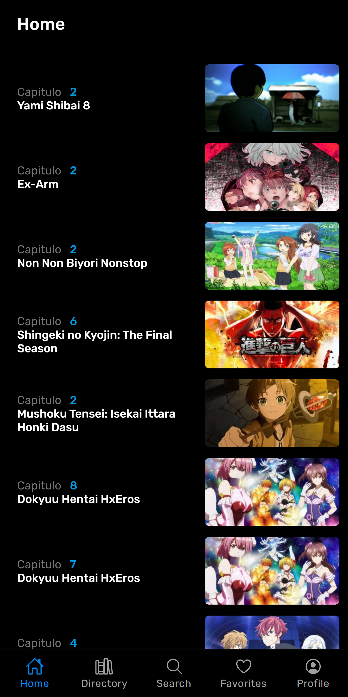
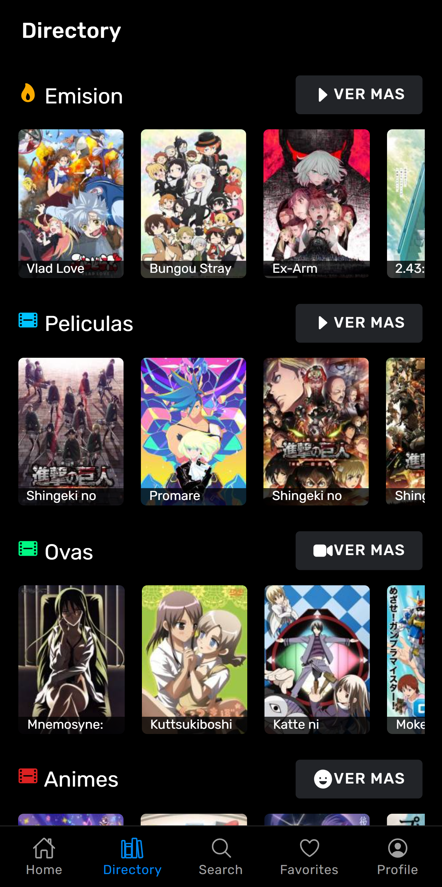
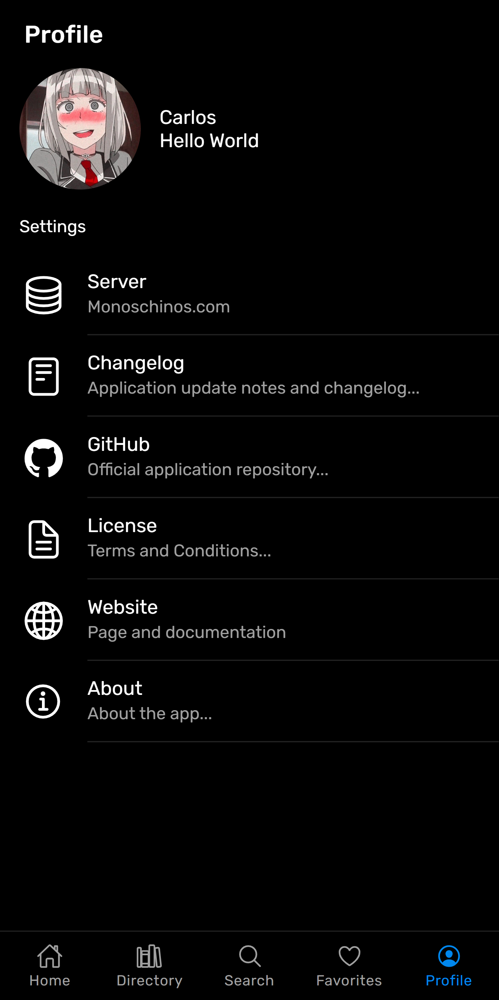
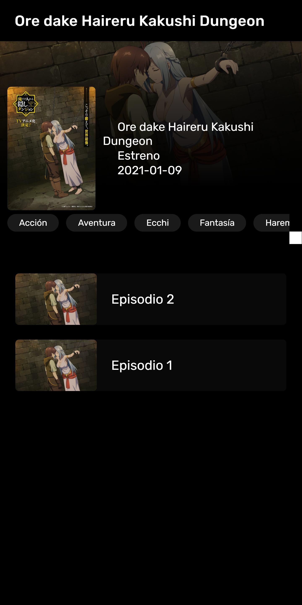

# Stadia

## Monoschinos Unoficial PWA


<div style="display:flex">
    
    
    
    
    
</div>

This project was generated with:

* [Angular](https://angular.io) version 10.0.0.
* [Ionic](https://ionic.io/) version 5.0.0

## Development server

```
    npm run dev
```

Navigate to `http://localhost:4200/`. The app will automatically reload if you change any of the source files.

## Code scaffolding

```
    ionic generate
```

You can also use `ng generate directive|pipe|service|class|guard|interface|enum|module`.

## Build

```
    ng build --prod
```

The build artifacts will be stored in the `dist/` directory. Use the `--prod` flag for a production build.

## Author

### Carlos Burelo