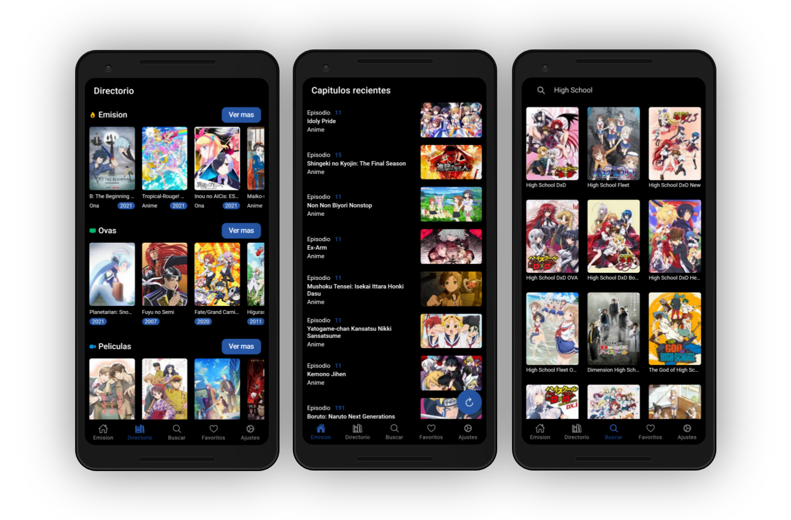
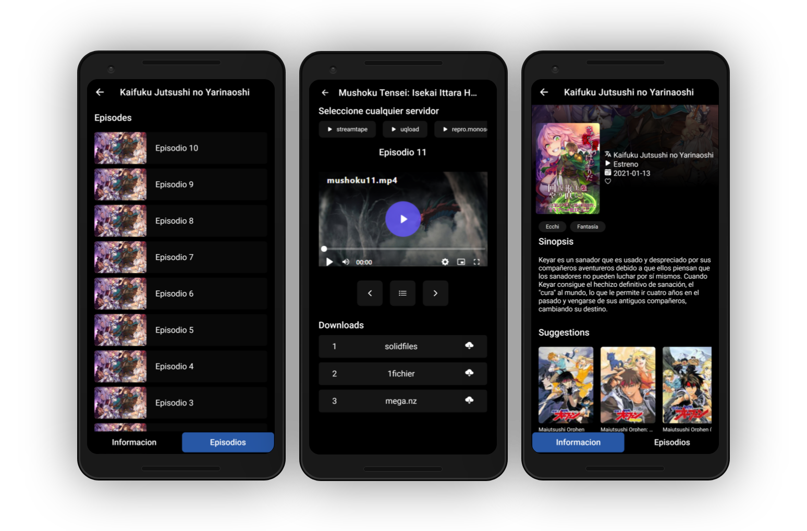

 
    
    <h1 style="font-size: 50px"> Stadia </h1>

# Monoschinos Unoficial PWA  

### Preview (PWA Aplication)

## What is Stadia?

Stadia is an open source project that allows you to view the content of the monoschinos2.com page in the application format, with the purpose of making the visualization and location of the content of the page in question more comfortable

## How does it work?.

A REST API was developed in conjunction with another developer, who using the Web Scraping concept, extracts the necessary data from the original page and returns them as objects or arrays of objects so that the Front -End can interpret it and later print it on screen.

Using Angular as a Front-end framework and being a single page Application, it renders in real time the content it receives from the API on the same page.

#### Original api credits to: **atleugim**

## Designed for simplicity.

Thought to have a friendly interface and a comfortable user experience, it was decided Use the Netflix platform interface as a reference for greater convenience, but make no mistake, Stadia keeps details of the same application

#### This project was generated with:

* [Angular](https://angular.io) version 11.2.0
* [Ionic](https://ionic.io/) version 5.5.2

## Author
### Carlos Burelo